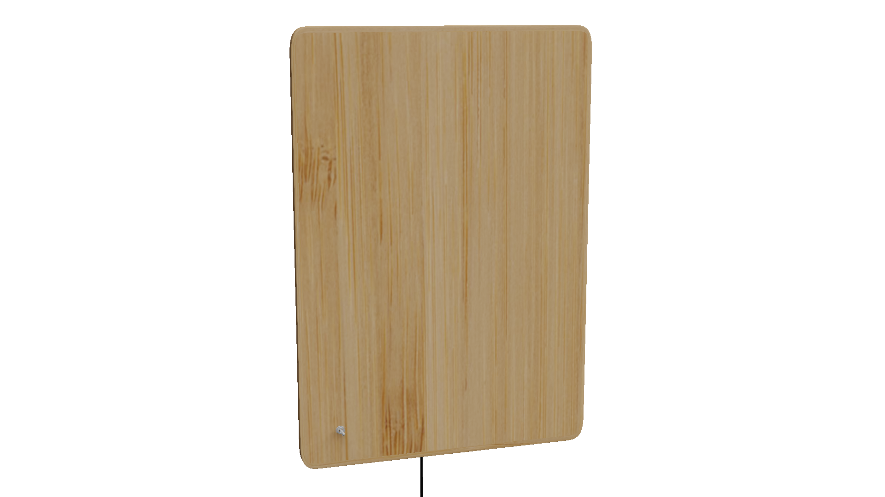
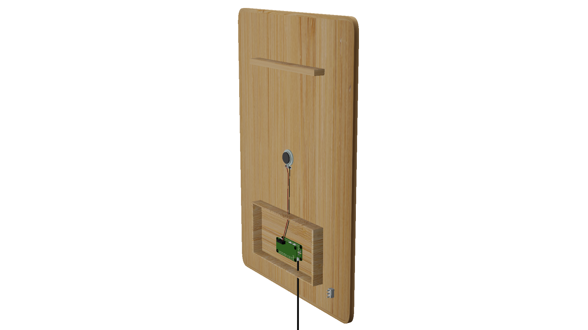

# pogłos

endless music box. wip.

**pogłos**

1. an acoustic phenomenon consisting in the prolongation of sound, caused by the action of reflected waves in  a closed room
2. a multiplication of sound
3. a reference to something, especially in someone's work

## intent

pogłos is a generative sonic atmosphere contained in a wooden frame.

it is slightly bigger than an A4 piece of paper, and it consists of a a small computer, a switch, and a speaker. the switch turns on the computer, the computer starts generating an ever-evolving version of a musical composition, and the speaker emits vibrations from the wood to fill the room with a soundscape. compositions are each conceived as a generative system, specifically for pogłos. they intend to live in the background of our lives, setting an atmosphere, decorating our sonic environment.

view some of the compositions live here: [https://periode.github.io/tonkasten]

## thoughts and influences

- [buddha machine](https://www.youtube.com/watch?v=VlSM3GMuYVU), for the product design
- erik satie's [vexations](https://en.wikipedia.org/wiki/Vexations), for the ability to repeat the same motif without boredom
- brian eno's generative music (made with [Koan](https://www.wired.com/1997/10/can-generative-music-carry-the-nets-tunes/), now rebranded as [Wotja](https://intermorphic.com/wotja/)), for the technical contribution
- [listen to wikipedia](http://listen.hatnote.com/), for the possible data visualization
- [brand new noise](https://www.brandnewnoise.com/), for the product design (without the interaction/instrument aspect)

## details

- dimensions: 42cm * 26cm * 5cm
- weight: 1.2kg
- computer: raspberry pi zero w
- power supply: 5.1V / 2.5A
- speaker: dayton 3W 4Ohm exciter
- dac + amplifier: hifiberry miniamp / adafruit speaker bonnet
- mount material: cnc wooden frame with linseed oil finish

see [hardware](hardware/README.md) and [software](software/README.md)for more details

## images

